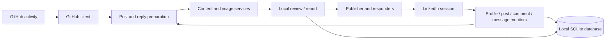

# LinkedIn Activity Assistant

> A local Python tool for monitoring a LinkedIn profile, turning verified GitHub activity into draft content, preparing replies, generating activity reports, and publishing through a browser session.

<p align="center">
  <a href="https://github.com/Vahid-Rahmani/agent-for-linkdin"></a>
  <a href="https://www.python.org/"></a>
  <a href="https://playwright.dev/python/"></a>
  <a href="https://github.com/Vahid-Rahmani/agent-for-linkdin/blob/main/LICENSE"></a>
</p>

## Purpose

This project keeps LinkedIn workflow data local while connecting three practical areas: profile activity, GitHub project activity, and content operations. It is designed for the account owner, not for bulk messaging or unsolicited outreach.

## Workflow map



## Capabilities

- Persistent Playwright session for manual first-time login.
- Profile, post, comment, and message activity monitoring.
- GitHub repository activity retrieval for project-based content.
- Post generation and improvement with the configured OpenAI-compatible provider.
- Context-matched image generation with fallback providers.
- Reply drafting for comments and messages.
- Local SQLite history and Rich CLI output.
- Activity reports and a full workflow command.

## Safety boundary

The automation commands can publish or respond without an interactive approval prompt. Run them only for your own account, review generated content and recipients, keep activity within LinkedIn policies, and start with `monitor` or `report` before enabling publishing. Rate limits in the application reduce frequency; they do not replace human oversight.

## Setup

```bash
git clone https://github.com/Vahid-Rahmani/agent-for-linkdin.git
cd agent-for-linkdin
python -m venv .venv
# Windows PowerShell
.\.venv\Scripts\Activate.ps1
pip install -r requirements.txt
playwright install chromium
```

Create a local `.env` file. Keep it out of Git:

```env
OPENCODE_API_KEY=your_provider_key
LINKEDIN_PROFILE_URL=https://www.linkedin.com/in/vahid-rahmani-699944417/
GITHUB_TOKEN=your_read_only_github_token
GITHUB_REPO=Vahid-Rahmani/agent-for-linkdin
HF_TOKEN=optional_image_provider_token
```

The OpenCode-compatible endpoint and model are configured in `config/settings.py`. Use provider terms and quotas that apply to your account. Never commit API keys, browser state, cookies, database files, or generated private messages.

## CLI

```bash
python main.py login
python main.py monitor
python main.py report
python main.py post
python main.py reply
python main.py run
```

Use `python cli.py --help` for the secondary Click interface. The first login opens Chromium so the account owner can authenticate manually; session data is then stored locally for subsequent runs.

## Project structure

```text
.
├── ai/          # content, reply, improvement and image generation
├── auth/        # Playwright session and login handling
├── automation/  # publishing and response actions
├── config/      # environment-backed settings and selectors
├── database/    # local SQLite persistence
├── github/      # GitHub activity client
├── models/      # post, comment and message models
├── monitor/     # LinkedIn activity monitors
├── reports/     # activity report generation
├── cli.py       # Click-based interface
└── main.py      # primary command entry point
```

## Roadmap

- [x] Local session and activity-monitoring foundation
- [x] GitHub-to-content workflow
- [x] Post, reply, report, and image-generation modules
- [ ] Explicit review queue before publish/reply
- [ ] Provider health checks and retry visibility
- [ ] Automated tests with browser fixtures
- [ ] Safer per-action consent and audit log UI

## Author

[Vahid Rahmani](https://www.linkedin.com/in/vahid-rahmani-699944417/) · [GitHub](https://github.com/Vahid-Rahmani) · [Portfolio](https://vahid-portfolio-three.vercel.app/)

## License

MIT License. See [LICENSE](LICENSE).
